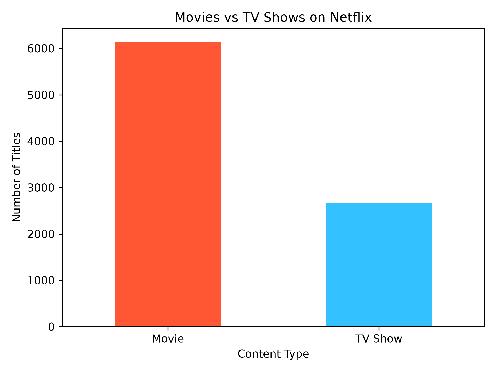
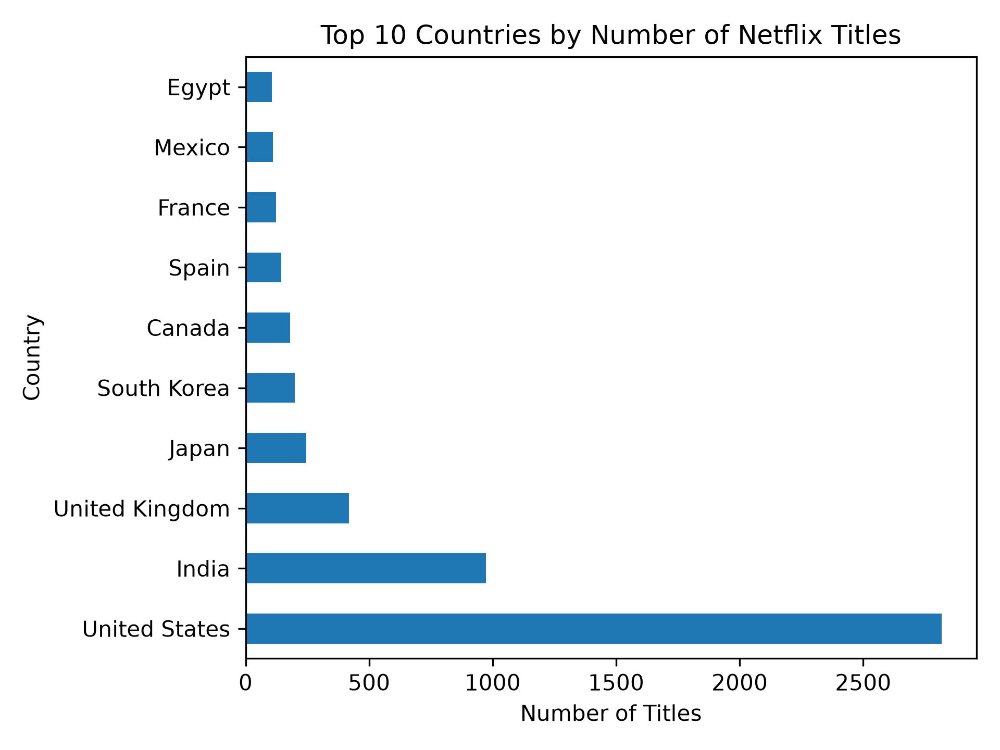
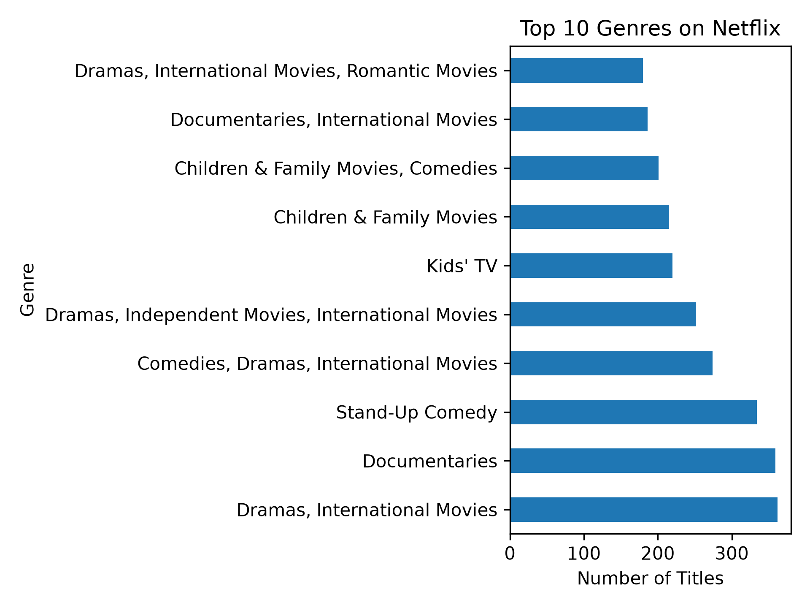
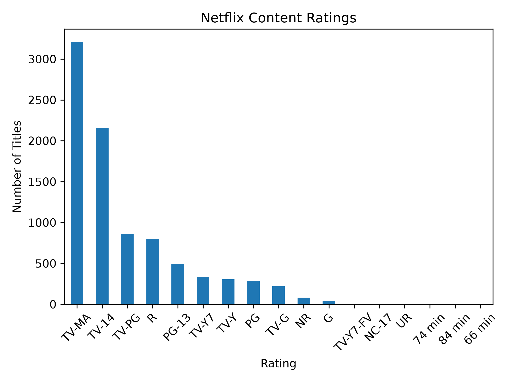
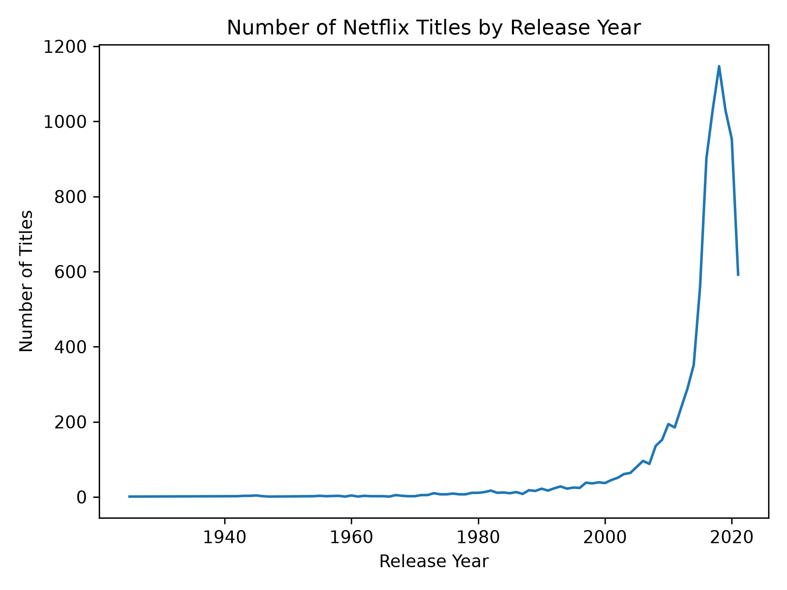

# 🎬 Netflix Data Analysis

A comprehensive data analysis project exploring the Netflix Movies and TV Shows dataset using Python, Pandas, and Matplotlib.

---

## 📖 Project Overview

The goal of this project is to analyze Netflix's catalog and uncover meaningful insights through data cleaning, exploratory data analysis (EDA), and data visualization.

The analysis focuses on:

- Movies vs TV Shows
- Top producing countries
- Most popular genres
- Content ratings
- Release year trends
- Top directors

---

## 🛠️ Technologies Used

- Python
- Pandas
- Matplotlib
- Jupyter Notebook
- Git
- GitHub

---

## 📂 Project Structure

```

netflix-data-analysis/
│
├── data/
│ └── netflix_titles.csv
│
├── images/
│ ├── movie_vs_tvshow.png
│ ├── top_countries.png
│ ├── top_genres.png
│ ├── content_ratings.png
│ └── release_year_trend.png
│
├── notebook/
│ └── netflix_analysis.ipynb
│
├── README.md
├── requirements.txt
└── .gitignore

```

---

## 📊 Analysis Performed

✔ Data Loading

✔ Data Cleaning

✔ Exploratory Data Analysis (EDA)

✔ Data Visualization

✔ Key Insights

✔ Conclusions

---

## 📈 Visualizations

### Movies vs TV Shows



---

### Top 10 Countries



---

### Top Genres



---

### Content Ratings



---

### Release Year Trend



---

## 🔍 Key Findings

- Movies significantly outnumber TV Shows.
- The United States contributes the highest number of Netflix titles.
- Drama and International Movies are among the most common genres.
- TV-MA is the most frequent content rating.
- Netflix's catalog has expanded rapidly over recent years.

---

## 🚀 Installation

Clone the repository

```bash
git clone https://github.com/Woxnkr/netflix-data-analysis.git
```

Install the required libraries

```bash
pip install -r requirements.txt
```

Launch Jupyter Notebook

```bash
jupyter notebook
```

---

## 🎯 Future Improvements

Possible enhancements include:

- Interactive dashboards using Plotly
- Machine Learning predictions
- Seaborn visualizations
- Streamlit dashboard

---

## 👨‍💻 Author

**Mehmet Erdoğan Mutlu**

GitHub:
https://github.com/Woxnkr